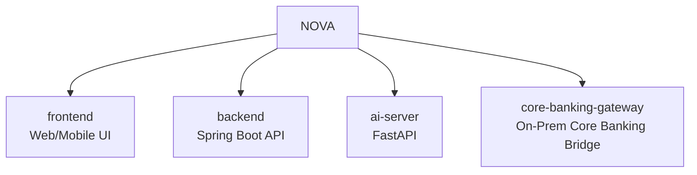
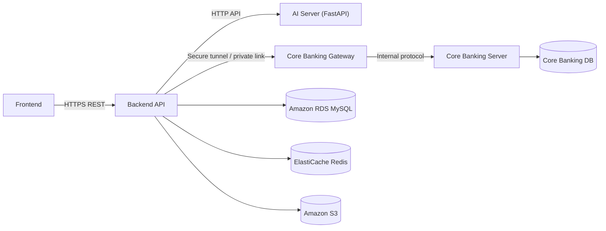
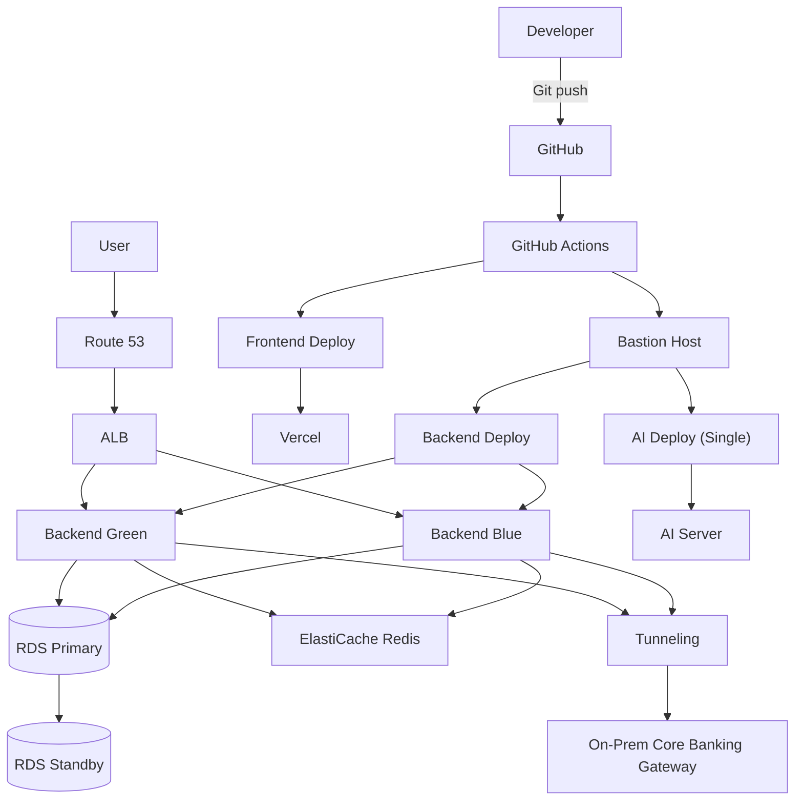
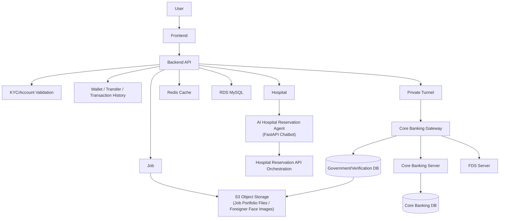

# NOVA

외국인 대상 비대면 금융/생활 밀착 서비스.
핵심 목표: 비대면 신원 인증 기반 임시 제한 계좌 개설, 최소 금융 기능, 생활 서비스 연계를 통해 외국인들의 외국인등록증 발급 전 금융 공백 해소 및 생활 정착 보조.

## Repository Structure

Sub-project relations:

## Deploy Diagram

## Operations Diagram

## Monorepo Golden Rules

### Immutable
- 모든 금융 거래는 백엔드 도메인 서비스에서만 처리한다. 프론트/AI 서버(FastAPI 챗봇 포함)에서 금액 확정 로직을 수행하지 않는다.
- 인증서 발급 및 계좌 개설은 여권 및 liveness 검증 없이 진행할 수 없으며, 이체/해외송금은 계좌 비밀번호 검증을 통해서만 수행한다.
- 원장성 데이터(거래내역, 잔액, 계좌상태)는 Core Banking 응답과 백엔드 상태가 불일치하면 실패 처리한다.
- 비밀정보(API 키, 인증서, 터널링 자격증명, DB 계정)는 코드/로그에 남기지 않는다.
- 액세스/보안 관련 키 값은 노출되지 않도록 저장소에 평문으로 커밋되지 않도록 하며, 환경변로 처리한다.

### Do
- 계약 우선: FE-BE, BE-AI(FastAPI), BE-CoreBanking 간 API 스펙을 먼저 고정하고 구현한다.
- 장애 격리: Core Banking 연동 실패 시 재시도 정책과 보상 흐름을 명시한다.
- 감사 추적: 인증/이체/계좌개설 단계는 모두 추적 가능한 이벤트 로그를 남기고, 로그는 롤링 파일 형식으로 생성/보관한다.
- 다국어 UX를 고려해 메시지 키 기반 응답을 우선한다.

### Don't
- Core Banking 연동 모듈에서 임의 비즈니스 규칙을 추가하지 않는다.
- 인증 우회 플래그(예: `skipKyc=true`)를 운영 경로에 추가하지 않는다.
- 거래 성공 전에 잔액 UI를 낙관적으로 확정하지 않는다.

## Agent Routing

- 백엔드 도메인/엔티티/트랜잭션 수정: `backend` 규칙 파일 우선 적용.
- UI/UX/상태관리 수정: `frontend` 규칙 파일 우선 적용.
- 병원 예약 챗봇/에이전트 로직(FastAPI) 수정: `ai-server` 규칙 파일 우선 적용.
- 코어뱅킹 인터페이스/터널링/프로토콜 수정: `core-banking-gateway` 규칙 파일 우선 적용.

## Maintenance Policy

- 이 문서와 실제 코드/인프라가 달라지면, 기능 변경 PR에 `AGENTS.md` 또는 하위 규칙 파일 동시 업데이트를 포함한다.
- 하위 모듈 규칙과 충돌 시, 더 하위 디렉토리의 규칙을 우선 적용한다.
