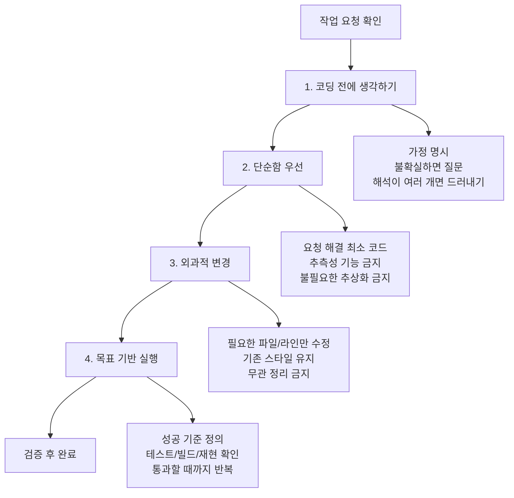

# Backend: NOVA

Spring Boot 기반 REST API 서버. 외국인 대상 인증/금융/생활 도메인 핵심 규칙을 담당한다.

## Behavioral Guidelines

속도보다 정확성을 우선한다. 단순 작업도 아래 원칙을 기본으로 적용한다.

### 1. Think Before Coding
- 불확실한 요구를 임의로 확정하지 않는다.
- 가정을 명시하고, 모호하면 질문한다.
- 더 단순한 대안이 있으면 먼저 제안한다.

### 2. Simplicity First
- 요청 해결에 필요한 최소 구현만 반영한다.
- 최소 구현을 반영하기 전에 생성/수정할 코드와 변경 범위, 적용 이유를 먼저 설명하고 합의된 범위 안에서만 반영한다.
- 요청 없는 확장성/옵션/추상화는 추가하지 않는다.
- 실제 요구되지 않은 예외 시나리오를 과도하게 구현하지 않는다.

### 3. Surgical Changes
- 변경은 요청과 직접 관련된 파일/라인으로 제한한다.
- 기존 코드 스타일을 따른다.
- 무관한 리팩터링/포맷팅/주석정리는 금지한다.

### 4. Goal-Driven Execution
1. 목표와 DoD 확정 -> 검증: 목표가 테스트 가능한지 확인
2. 최소 변경 구현 -> 검증: 타깃 테스트 실패/성공 확인
3. 회귀 검증 -> 검증: `compileJava`/`test` 결과 확인

## Mandatory Work Intake

코드 작업 시작 시 아래를 먼저 고정한다.

- Goal: 한 줄 목표
- DoD: 완료 조건
- Module: 대상 모듈/도메인
- Target Test: `bash ./gradlew test --tests ...`
- Allowed: 수정 허용 범위
- Forbidden: 수정 금지 범위
- Checkpoints: 설계 확인 -> RED 실패 확인 -> GREEN 통과 확인

기본 정책(별도 지시 없을 때):
- 수정 가능: 작업 대상 도메인 + 직접 연관 테스트 + 직접 연관 문서
- 수정 금지: 무관 도메인, 인프라/배포 설정, 광범위 리네이밍
- 리네이밍: 명시적 승인 없으면 금지

## TDD Workflow

모든 코드 변경은 RED -> GREEN -> REFACTOR 순서를 따른다.

- RED: 실패하는 테스트를 먼저 추가/수정하고 실패를 확인한다.
- GREEN: 테스트를 통과시키는 최소 구현만 적용한다.
- REFACTOR: 동작 유지 상태에서 중복 제거/가독성 개선을 수행한다.

실패 테스트 증거 없이 구현부터 시작하지 않는다.

## Fixed Verification Commands

- 타깃 테스트: `bash ./gradlew test --tests <target>`
- 전체 테스트: `bash ./gradlew test`
- 컴파일 점검: `bash ./gradlew compileJava`

문서 전용 변경으로 테스트 타깃이 없으면, 수정 파일 목록과 근거 문서를 보고한다.

## Fixed Response Format

최종 보고는 아래 순서를 유지한다.

1. 변경 요약 3줄
2. RED / GREEN / REFACTOR 요약
3. 파일 목록
4. 리스크
5. 다음 액션

## Document Priority

충돌 시 아래 우선순위를 따른다.

1. 가장 가까운 경로의 `AGENTS.md`
2. 루트 `AGENTS.md`
3. 변경 성격별 상세 문서
4. 실제 코드

변경 성격별 상세 문서 우선순위:
- API 경로/요청/응답/권한 충돌: `docs/rest_api.md`
- 엔티티/테이블/enum/관계 충돌: `docs/erd.md`
- 패키지 위치/도메인 책임 충돌: `docs/package.md`

문서와 코드가 충돌하면 문서 기준으로 정렬하고, 결과를 작업 보고에 명시한다.

### Reference Docs

- API 경로/요청/응답/권한: `docs/rest_api.md`
- 엔티티/테이블/enum/관계: `docs/erd.md`
- 패키지 위치/도메인 책임: `docs/package.md`

## Root-Level Architecture Rules (Backend)

- API prefix는 `/{도메인 이름}`를 기본으로 한다.
- 공통 응답은 `global/response` 래퍼 규칙을 유지한다.
- 비즈니스 예외는 `global/exception` 계층을 사용한다.
- 컨트롤러에서 엔티티 직접 반환 금지, DTO 변환 필수.
- 삭제는 DELETE 메서드 대신 POST 기반 soft delete(`has_delete=true`)로 처리한다.
- 금융 거래 확정 로직은 서비스 계층에서만 처리한다.
- 금융 원장 상태와 비금융 상태 모두 AI(FastAPI) 및 클라우드 애플리케이션 계층에서 직접 수정하지 않는다.
- 금융 원장 상태 변경은 클라우드 banking 도메인에서 온프레미스 Core Banking Gateway/Server로 요청을 전달한 뒤, 온프레미스 Core Banking에서만 최종 반영한다.
- 수취인 조회는 클라우드 `banking` API에서 처리하되, 예금주명 검증 데이터는 coreBanking 연동 API 응답을 기준으로 한다.

## Logging Policy

- 로깅 프레임워크: SLF4J 기반 (`@Slf4j`) 사용.
- 로그 저장은 Logback 롤링 파일 정책을 기본으로 적용한다(파일 크기/일자 기준 순환 및 보관 주기 설정).
- `System.out/err`, `printStackTrace` 사용 금지.
- 비밀번호, 토큰, 계좌번호 전체, 주민/여권 원문 등 민감정보 로깅 금지.
- 외부 연동(AI/CoreBanking)은 진입/종료/실패 3지점 로그를 남긴다.
- 예외를 catch 했으면 최소 WARN 이상으로 원인과 식별자를 기록한다.

권장 레벨:
- ERROR: 거래 실패, 외부 연동 실패, 복구 불가 예외
- WARN: 재시도/폴백, 비정상 입력/검증 실패
- INFO: 주요 상태 전환(인증, 계좌개설, 이체, 예약)
- DEBUG: 개발/트러블슈팅 상세 정보

## Docs Sync Rule

다음 변경 시 관련 문서를 같이 갱신한다.

- API 경로/요청/응답/권한
- 엔티티/테이블/인덱스/제약/enum
- 모듈 구조/도메인 책임
- 운영 환경변수
- 외부 연동 방식

## What Not To Do

- 컨트롤러에 비즈니스 로직 작성 금지
- 엔티티를 응답으로 직접 반환 금지
- 무관한 패키지 대규모 리네이밍 금지
- 인증 우회 플래그를 운영 코드에 추가 금지
- 하위 규칙 없는 상태에서 임의로 아키텍처 경계를 변경 금지
