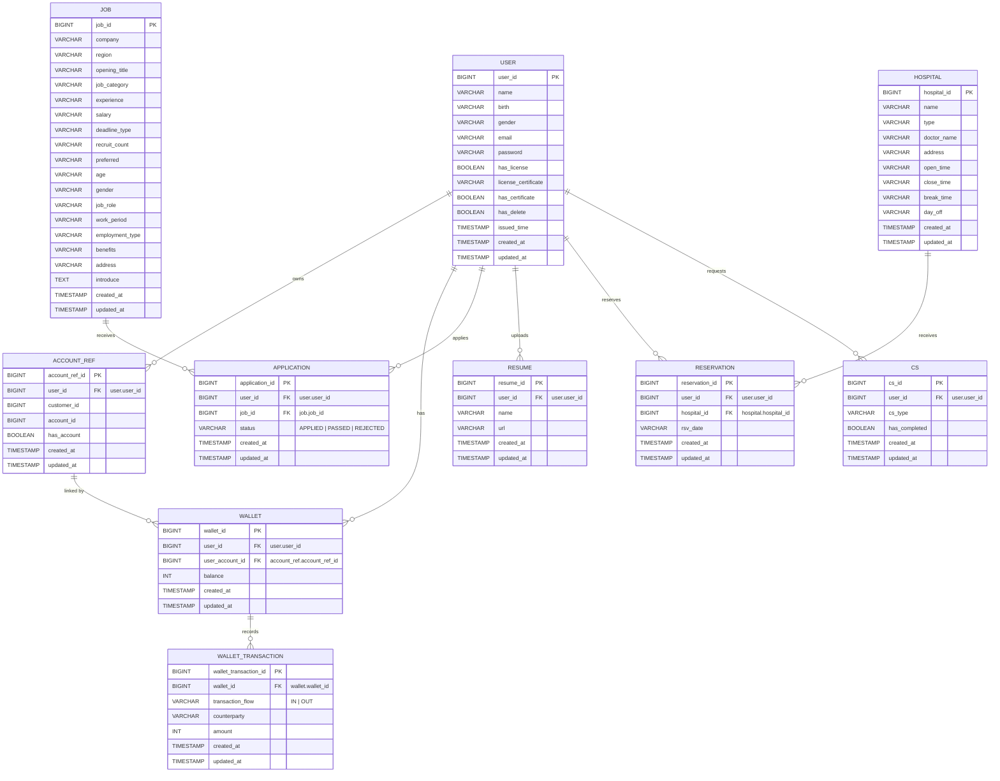

# ERD

현재 NOVA 백엔드 ERD 기준 문서.
실제 구현 시 테이블/컬럼명은 영문 `snake_case`를 사용하고, 초안의 표기 불일치(약어, 오탈자, 혼합 표기)는 의미에 맞게 정규화한다.

## Diagram

## Modeling Rules

- `user`는 현재 도메인의 루트 소유자이며, 금융/비금융 데이터는 `user_id`를 기준으로 연결한다.
- `wallet.user_account_id`는 `account_ref.account_ref_id`를 참조한다.
- `wallet_transaction`은 지갑 단위 입출금 이력을 관리하며, 거래 방향은 `transaction_flow` enum으로 구분한다.
- `application`은 사용자-채용공고 관계의 상태 이력을 가진다.
- `reservation`은 사용자-병원 예약 관계를 나타내며, 예약 가능 여부 판단 로직은 서비스 계층에서 관리한다.
- `cs`는 사용자 상담 요청 이력이며, `has_completed`로 완료 여부를 표현한다.

## Enum Values

| Field | Values |
|---|---|
| `user.gender` | `MALE`, `FEMALE` |
| `wallet_transaction.transaction_flow` | `IN`, `OUT` |
| `application.status` | `APPLIED`, `PASSED`, `REJECTED` |
| `hospital.type` | `INTERNAL_MEDICINE`, `ORTHOPEDICS`, `DENTAL`, `OTHER` |
| `cs.cs_type` | `INQUIRY`, `COMPLAINT`, `SUGGESTION`, `OTHER` |

## Notes

- `rsv_date`, `open_time`, `close_time`, `break_time`, `day_off`는 현재 문자열 기반으로 관리한다.
- 시간/요일 정규화가 필요해지면 별도 스키마 마이그레이션으로 `DATE/TIME` 분리 전략을 적용한다.
- 인증서/민감정보(`license_certificate` 등)는 저장 시 암호화/마스킹 정책을 별도로 적용한다.
