# ERD

현재 NOVA 백엔드의 JPA 엔티티(`backend/src/main/java/.../domain/**/entity`) 기준 ERD 문서.

## Diagram

```mermaid
erDiagram
  USER {
    BIGINT user_id PK
    VARCHAR_100 name
    VARCHAR_10 birth
    ENUM gender "MALE | FEMALE"
    VARCHAR_100 email "UNIQUE"
    VARCHAR_255 password
    BOOLEAN has_residence_card
    ENUM certificate_status "NOT_ISSUED | PENDING | ISSUED"
    BOOLEAN has_delete
    TIMESTAMP issued_time
    TIMESTAMP created_at
    TIMESTAMP updated_at
  }

  RESIDENCE_CARD {
    BIGINT residence_card_id PK
    BIGINT user_id FK
    VARCHAR_100 registration_num
    VARCHAR_100 country
    VARCHAR_100 status
    VARCHAR_100 issue_date
    VARCHAR_100 expiration_date
    TIMESTAMP created_at
    TIMESTAMP updated_at
  }

  DOCUMENT {
    BIGINT document_id PK
    BIGINT user_id FK
    ENUM document_type "ALIEN_REGISTRATION_SUPPORTING_DOCUMENT | RESIDENCE_VERIFICATION_DOCUMENT"
    TEXT file_url
    ENUM status "PENDING | APPROVED | REJECTED | MODIFIED"
    TEXT missing
    TIMESTAMP created_at
    TIMESTAMP updated_at
  }

  NOTIFICATION {
    BIGINT notification_id PK
    BIGINT user_id FK
    ENUM type "SUPPLEMENT_DOCUMENT | RESIDENCE_CARD_PERIOD"
    TEXT content
    TIMESTAMP created_at
    TIMESTAMP updated_at
  }

  ACCOUNT_REF {
    BIGINT account_ref_id PK
    BIGINT user_id FK
    BIGINT customer_id
    BIGINT account_id
    BOOLEAN has_account
    VARCHAR_100 account_name
    VARCHAR_100 account_number
    INT balance
    BOOLEAN has_limit
    INT transfer_limit
    TIMESTAMP created_at
    TIMESTAMP updated_at
  }

  WALLET {
    BIGINT wallet_id PK
    BIGINT user_id FK
    BIGINT user_account_id FK
    INT balance
    TIMESTAMP created_at
    TIMESTAMP updated_at
  }

  WALLET_TRANSACTION {
    BIGINT wallet_transaction_id PK
    BIGINT wallet_id FK
    ENUM transaction_flow "DEPOSIT | WITHDRAWAL"
    VARCHAR_100 counterparty
    INT amount
    TIMESTAMP created_at
    TIMESTAMP updated_at
  }

  JOB {
    BIGINT job_id PK
    VARCHAR_100 company
    VARCHAR_100 region
    VARCHAR_100 opening_title
    VARCHAR_50 job_category
    VARCHAR_50 experience
    VARCHAR_50 salary
    VARCHAR_50 deadline_type
    VARCHAR_50 recruit_count
    VARCHAR_100 preferred
    VARCHAR_50 age
    VARCHAR_50 gender
    VARCHAR_50 job_role
    VARCHAR_50 work_period
    VARCHAR_50 employment_type
    VARCHAR_100 benefits
    VARCHAR_255 address
    TEXT introduce
    TIMESTAMP created_at
    TIMESTAMP updated_at
  }

  JOB_TRANSLATION {
    BIGINT job_translation_id PK
    BIGINT job_id FK
    VARCHAR_10 language
    VARCHAR_100 company
    VARCHAR_100 region
    VARCHAR_100 opening_title
    VARCHAR_50 job_category
    VARCHAR_50 experience
    VARCHAR_50 salary
    VARCHAR_50 deadline_type
    VARCHAR_50 recruit_count
    VARCHAR_100 preferred
    VARCHAR_50 age
    VARCHAR_50 gender
    VARCHAR_50 job_role
    VARCHAR_50 work_period
    VARCHAR_50 employment_type
    VARCHAR_100 benefits
    VARCHAR_255 address
    TEXT introduce
    TIMESTAMP created_at
    TIMESTAMP updated_at
  }

  APPLICATION {
    BIGINT application_id PK
    BIGINT user_id FK
    BIGINT job_id FK
    ENUM status "PASSED | FAILED | READ | UNREAD"
    TIMESTAMP created_at
    TIMESTAMP updated_at
  }

  APPLICATION_RESUME {
    BIGINT application_resume_id PK
    BIGINT application_id FK
    BIGINT resume_id FK
    TIMESTAMP created_at
    TIMESTAMP updated_at
  }

  RESUME {
    BIGINT resume_id PK
    BIGINT user_id FK
    VARCHAR_100 name
    VARCHAR_255 url
    TIMESTAMP created_at
    TIMESTAMP updated_at
  }

  HOSPITAL {
    BIGINT hospital_id PK
    VARCHAR_100 name
    ENUM type "INTERNAL_MEDICINE | ORTHOPEDICS | DENTAL | OTHER"
    VARCHAR_50 doctor_name
    VARCHAR_255 address
    VARCHAR_100 open_time
    VARCHAR_100 close_time
    VARCHAR_100 break_time
    VARCHAR_100 day_off
    TIMESTAMP created_at
    TIMESTAMP updated_at
  }

  RESERVATION {
    BIGINT reservation_id PK
    BIGINT user_id FK
    BIGINT hospital_id FK
    DATETIME reserved_at
    ENUM status "RESERVED | CANCELED"
    TIMESTAMP created_at
    TIMESTAMP updated_at
  }

  HOSPITAL_AVAILABLE_SLOT {
    BIGINT slot_id PK
    BIGINT hospital_id FK
    DATETIME available_at
    BOOLEAN is_available
    TIMESTAMP created_at
    TIMESTAMP updated_at
  }

  CS {
    BIGINT cs_id PK
    BIGINT user_id FK
    ENUM cs_type "PRODUCT_SUBSCRIPTION | ACCOUNT_MAINTENANCE"
    BOOLEAN cs_status
    TIMESTAMP created_at
    TIMESTAMP updated_at
  }

  USER ||--o{ RESIDENCE_CARD : owns
  USER ||--o{ DOCUMENT : submits
  USER ||--o{ NOTIFICATION : receives
  USER ||--o{ ACCOUNT_REF : owns
  USER ||--o{ WALLET : has
  USER ||--o{ APPLICATION : applies
  USER ||--o{ RESUME : uploads
  USER ||--o{ RESERVATION : reserves
  USER ||--o{ CS : requests

  ACCOUNT_REF ||--o{ WALLET : linked_by
  WALLET ||--o{ WALLET_TRANSACTION : records

  JOB ||--o{ APPLICATION : receives
  JOB ||--o{ JOB_TRANSLATION : localizes
  APPLICATION ||--o{ APPLICATION_RESUME : attaches
  RESUME ||--o{ APPLICATION_RESUME : used_by
  HOSPITAL ||--o{ RESERVATION : receives
  HOSPITAL ||--o{ HOSPITAL_AVAILABLE_SLOT : opens
```

## Modeling Rules

- 모든 엔티티는 `BaseEntity`를 상속하며 `created_at`, `updated_at`을 가진다.
- `wallet.user_account_id`는 `account_ref.account_ref_id`를 참조한다.
- `application_resume`은 `application`과 `resume`의 N:M 관계를 해소하는 중간 테이블이며, 지원서에 반영된 기존 S3 포트폴리오와 신규 첨부파일을 모두 연결한다.
- `job_translation`은 `job_id + language` 단위로 공고 표시 필드 번역을 저장하며, 번역 row 또는 필드가 없으면 기본 `job` row 값을 사용한다.
- 기존 `application.resume_id` 단건 연결 데이터는 `db/seed/application-resume-backfill.sql`로 `application_resume`에 이관한다.
- `application.status`, `document.document_type`, `document.status`, `notification.type`은 문자열 enum으로 저장한다.
- `cs.cs_status`는 코드상 `boolean`이며 의미상 `PENDING(false)`, `COMPLETED(true)`로 사용한다.

## Enum Values

| Field | Values |
|---|---|
| `user.gender` | `MALE`, `FEMALE` |
| `user.certificate_status` | `NOT_ISSUED`, `PENDING`, `ISSUED` |
| `wallet_transaction.transaction_flow` | `DEPOSIT`, `WITHDRAWAL` |
| `application.status` | `PASSED`, `FAILED`, `READ`, `UNREAD` |
| `hospital.type` | `INTERNAL_MEDICINE`, `ORTHOPEDICS`, `DENTAL`, `OTHER` |
| `reservation.status` | `RESERVED`, `CANCELED` |
| `cs.cs_type` | `PRODUCT_SUBSCRIPTION`, `ACCOUNT_MAINTENANCE` |
| `document.document_type` | `ALIEN_REGISTRATION_SUPPORTING_DOCUMENT`, `RESIDENCE_VERIFICATION_DOCUMENT` |
| `document.status` | `PENDING`, `APPROVED`, `REJECTED`, `MODIFIED` |
| `document.missing` | 반려 사유 코드 콤마 구분값. 예: `RESIDENCE_ADDRESS_PAGE_MISSING,RESIDENCE_ISSUED_WITHIN_3_MONTHS_REQUIRED` |
| `notification.type` | `SUPPLEMENT_DOCUMENT`, `RESIDENCE_CARD_PERIOD` |
| `cs.cs_status` | `PENDING(false)`, `COMPLETED(true)` |

## Notes

- Hospital 도메인에서 `hospital.open_time`, `hospital.close_time`, `hospital.break_time`, `hospital.day_off`는 현재 문자열 기반으로 저장한다.
- `reservation.reserved_at`은 `DATETIME` 기반으로 저장한다.
- `hospital_available_slot.available_at`은 병원 예약 가능 30분 슬롯을 의미하며, 예약 생성 시 `hospital_id + available_at` 슬롯을 조회한 뒤 `is_available=true`인지 검증한다.
- Residence Card 관련 필드(`registration_num`, `issue_date`, `expiration_date`)도 현재 문자열 기반으로 저장한다.
- `job.gender`는 현재 enum이 아닌 문자열 컬럼이다.
- `user.certificate_status` 상태 전이는 `NOT_ISSUED -> PENDING -> ISSUED` 순서만 허용한다.
