# Package Structure

Base package: `woorifisa.project.backend`

## Overview

```mermaid
flowchart TD
  root["woorifisa.project.backend"]
  root --> domain["domain"]
  root --> global["global"]

  domain --> auth["auth<br/>세션 인증, 로그인/로그아웃, 인증 유틸"]
  domain --> user["user<br/>회원 정보, 인증/증빙, 외국인등록증, 알림/보완서류 조회"]
  domain --> banking["banking<br/>계좌개설/이체/거래조회/메모수정, coreBanking 연계"]
  domain --> wallet["wallet<br/>서비스 월렛, 거래내역"]
  domain --> job["job<br/>채용공고, 지원내역, 지원하기"]
  domain --> hospital["hospital<br/>병원 정보, 예약, 에이전트 호출 연계"]
  domain --> cs["cs<br/>화상 상담 요청/처리(실시간 번역 STT)"]

  global --> config["config<br/>공통 설정(Security, JPA, CORS, OpenAPI)"]
  global --> corebanking["corebanking<br/>Core Banking 공통 REST 연동 클라이언트"]
  global --> government["government<br/>Government DB 공통 REST 연동 클라이언트"]
  global --> exception["exception<br/>공통 예외, 에러 코드, 전역 핸들러"]
  global --> response["response<br/>공통 API 응답 래퍼"]
  global --> entity["entity<br/>BaseEntity(감사 필드)"]
```

각 도메인 내부 기본 구조:

- `entity/`
- `service/`
- `repository/`
- `dto/`
- `controller/`

## Domain Ownership

| Domain | Responsibility |
|---|---|
| `auth` | 세션 인증, 로그인/로그아웃, 인증 보조(이메일/비밀번호 재설정 등) |
| `user` | 사용자 계정/프로필, 인증서 발급, 증빙서류(`document`), 외국인등록증(`residence_card`), 알림(`notification`) |
| `banking` | 계좌 개설/비밀번호 검증/이체/거래내역/메모/홈조회, Cloud↔On-Prem 브릿지 |
| `wallet` | 월렛 충전/차감/거래내역, 거래 흐름(`DEPOSIT`, `WITHDRAWAL`) |
| `job` | 구인공고, 지원 상태(`application`), 이력서(`resume`) |
| `hospital` | 병원 메타 정보, 예약 생성/조회 |
| `cs` | 상담 요청/유형/완료 상태 관리 |
| `global` | 공통 응답, 예외, 설정, 감사 필드, Core Banking/Government DB 공통 REST 연동 |

## Placement Rules

- `account_ref`는 `banking` 도메인에 둔다.
- `document`, `notification`, `residence_card`는 `user` 도메인에 둔다.
- `wallet`, `wallet_transaction`은 `wallet` 도메인에 둔다.
- `application`, `resume`은 `job` 도메인에 둔다.
- `reservation`은 `hospital` 도메인에 둔다.
- `cs` 관련 엔티티/enum은 `cs` 도메인에 둔다.
- 공통 예외/응답/설정은 `global`에만 둔다.
- Core Banking 클라이언트 인터페이스/구현은 `global/corebanking/client`에 단일 구성으로 두고, 도메인(`banking`, `wallet`)에서 별도 CoreBanking 클라이언트를 생성하지 않는다.
- Government DB 클라이언트 인터페이스/구현은 `global/government/client`에 단일 구성으로 두고, `user` 도메인은 해당 글로벌 클라이언트만 의존한다.
- `BaseEntity`는 `global/entity`에 두고 도메인 엔티티에서 상속한다.

## Service Boundaries

- 계좌 연동 핵심 로직은 `banking` 서비스에 둔다.
- Cloud Banking API는 온프레미스 Core Banking 연동 전/후 검증과 오케스트레이션을 담당한다.
- 월렛 잔액 변경과 거래 확정은 `wallet` 서비스에서만 처리한다.
- 병원 예약 확정 저장은 `hospital` 서비스에서 처리한다.
- FastAPI AI 서버는 병원 예약 추천/챗봇 보조 역할만 수행하며, 최종 예약 상태를 확정하지 않는다.
- 사용자 상태/자격증빙/보완서류/알림의 원천 데이터는 `user` 도메인이 관리한다.

## Cross-Domain Rules

- 컨트롤러는 오케스트레이션만 수행하고 비즈니스 규칙은 서비스에 둔다.
- 도메인 간 참조가 필요할 때는 서비스 계층에서 검증 후 접근한다.
- 응답 형태 분기는 엔티티가 아닌 DTO 계층에서 처리한다.
- 삭제 API는 `DELETE` 대신 `POST` 기반 soft delete(`has_delete=true`) 정책을 따른다.

## Coding Rules

- 컨트롤러에 비즈니스 로직 작성 금지
- 엔티티 직접 응답 반환 금지
- DTO 변환 명시 수행
- 필드 주입(`@Autowired`) 금지
- 생성자 주입 사용 (`@RequiredArgsConstructor` 권장)
- 기존 코드 스타일/네이밍 우선
- enum은 도메인 `entity/enums` 패키지에 분리

## Dependency Direction

- `controller -> service -> repository -> entity`
- `global`은 모든 도메인이 참조할 수 있지만, `global`이 특정 도메인 구현에 의존하면 안 된다.
- 도메인 간 순환 참조를 만들지 않는다.

## Docs Sync Rule

아래 변경 시 이 문서를 함께 갱신한다.

- 도메인 추가/삭제
- 도메인 책임 변경
- 패키지 경계 이동
- 공통 레이어(`global`) 책임 변경
