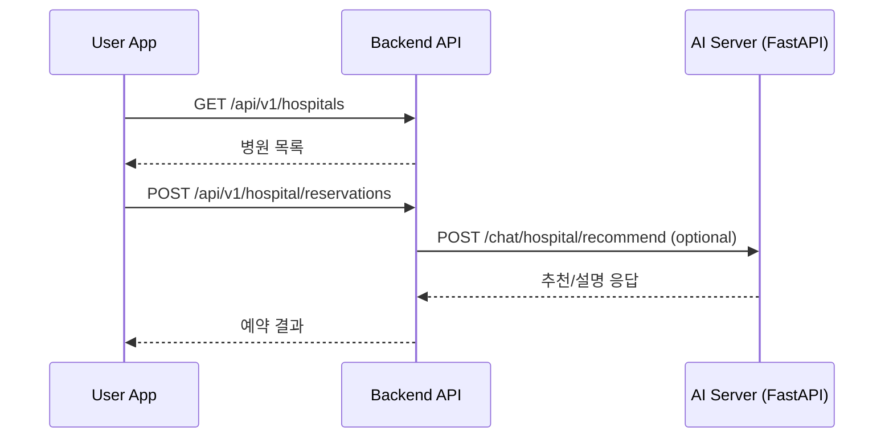
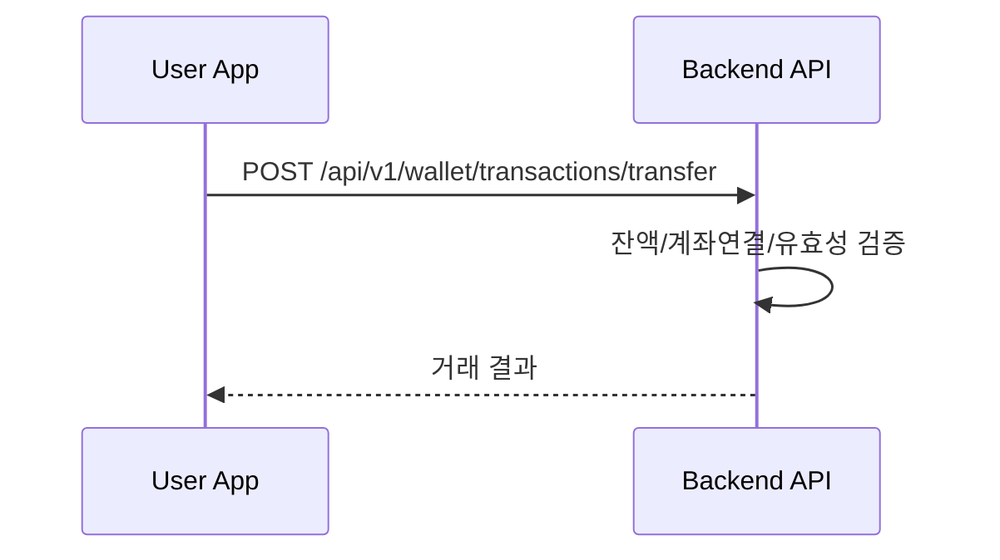

# REST API

모든 API 경로는 `/{도메인 이름}` prefix를 사용한다.
아래 표의 `Path`는 prefix를 제외한 상대 경로다.

## Common Rules

- 인증 방식은 세션 기반이다. JWT로 전환하지 않는다.
- `Auth=O`는 로그인 세션이 필요하고, `Auth=X`는 비로그인 호출 가능하다.
- Role은 `PUBLIC | USER | ADMIN`을 사용한다.
- 모든 응답은 백엔드 공통 응답 래퍼를 사용한다.
- 컨트롤러 엔드포인트에는 SpringDoc 어노테이션을 작성한다.
- 엔티티 직접 반환 금지, DTO 응답을 사용한다.
- 요청/응답 DTO의 세부 필드는 구현 단계에서 도메인 담당자가 최종 확정한다.

예시 응답 래퍼:

```json
{
  "success": true,
  "code": 20000,
  "message": "요청에 성공했습니다.",
  "data": {}
}
```

## Role Rules

| Role | Meaning |
|---|---|
| `PUBLIC` | 비로그인 호출 가능 |
| `USER` | 사용자 세션 필요 |
| `ADMIN` | 운영/관리자 세션 필요 |

권한 공통 규칙:
- `USER` API는 현재 세션 `userId` 기준으로 본인 데이터만 조회/변경한다.
- 타 사용자 데이터 접근은 관리자 API로 분리한다.

## Domain Flows

### Hospital Reservation + AI Agent

- 병원 예약 챗봇은 FastAPI 서버가 담당한다.
- 백엔드는 챗봇 응답을 보조 정보로 사용하며, 최종 예약 확정/저장은 백엔드 도메인 서비스가 담당한다.



### Wallet Transfer



## Hold Policy

| API ID | Status | Reason |
|---|---|---|
| `AUTH-004` | 구현 예정 | Face ID/생체 로그인 플로우 상세 정책 미확정 |
| `WALLET-004` | 장기 보류 | 외부 은행 실계좌 이체 연동 범위 확정 필요 |
| `HOSPITAL-005` | 구현 예정 | 챗봇 추천 기반 자동 예약 제안 UX 확정 필요 |

## API Catalog

| ID | Name | Method | Path | Auth | Role | Notes |
|---|---|---|---|---|---|---|
| `AUTH-001` | 회원가입 | POST | `/auth/register` | X | PUBLIC | 이메일/비밀번호/기본정보 등록 |
| `AUTH-002` | 로그인 | POST | `/auth/login` | X | PUBLIC | 세션 생성 |
| `AUTH-003` | 로그아웃 | POST | `/auth/logout` | O | USER | 세션 만료 |
| `AUTH-004` | Face ID 로그인 | POST | `/auth/login/face-id` | X | PUBLIC | 구현 예정 |
| `AUTH-005` | 이메일 인증번호 발송 | POST | `/auth/email/send` | X | PUBLIC | 회원가입/재설정 공용 |
| `AUTH-006` | 이메일 인증번호 검증 | POST | `/auth/email/verify` | X | PUBLIC | |
| `AUTH-007` | 비밀번호 재설정 | PATCH | `/auth/password/reset` | X | PUBLIC | |
| `USER-001` | 내 프로필 조회 | GET | `/users/me` | O | USER | |
| `USER-002` | 내 프로필 수정 | PATCH | `/users/me` | O | USER | |
| `USER-003` | 자격증/증빙 업로드 | POST | `/users/me/certificates` | O | USER | `has_license`, `has_certificate` 연계 |
| `BANK-001` | 계좌 연동 등록 | POST | `/banking/accounts` | O | USER | `account_ref` 생성 |
| `BANK-002` | 연동 계좌 목록 조회 | GET | `/banking/accounts` | O | USER | |
| `BANK-003` | 연동 계좌 단건 조회 | GET | `/banking/accounts/{accountRefId}` | O | USER | |
| `BANK-004` | 계좌 연동 해제 | DELETE | `/banking/accounts/{accountRefId}` | O | USER | |
| `WALLET-001` | 월렛 생성 | POST | `/wallet` | O | USER | 계좌 연동 필수 |
| `WALLET-002` | 월렛 잔액 조회 | GET | `/wallet/balance` | O | USER | |
| `WALLET-003` | 월렛 거래내역 조회 | GET | `/wallet/transactions` | O | USER | `transaction_flow` 필터 |
| `WALLET-004` | 월렛 이체 실행 | POST | `/wallet/transactions/transfer` | O | USER | 장기 보류 |
| `JOB-001` | 채용 공고 목록 조회 | GET | `/jobs` | X | PUBLIC | |
| `JOB-002` | 채용 공고 상세 조회 | GET | `/jobs/{jobId}` | X | PUBLIC | |
| `JOB-003` | 지원서 제출 | POST | `/jobs/{jobId}/applications` | O | USER | |
| `JOB-004` | 내 지원내역 조회 | GET | `/jobs/applications/me` | O | USER | |
| `JOB-005` | 이력서 업로드 | POST | `/jobs/resumes` | O | USER | |
| `JOB-006` | 내 이력서 목록 조회 | GET | `/jobs/resumes/me` | O | USER | |
| `HOSPITAL-001` | 예약 가능 병원 목록 조회 | GET | `/hospitals` | O | USER | 진료과/지역/시간 필터 |
| `HOSPITAL-002` | 병원 상세 조회 | GET | `/hospitals/{hospitalId}` | O | USER | |
| `HOSPITAL-003` | 병원 예약 생성 | POST | `/hospital/reservations` | O | USER | |
| `HOSPITAL-004` | 내 예약 목록 조회 | GET | `/hospital/reservations/me` | O | USER | |
| `HOSPITAL-005` | AI 기반 예약 추천 | POST | `/hospital/reservations/ai-recommend` | O | USER | 구현 예정 |
| `CS-001` | 상담 요청 생성 | POST | `/cs` | O | USER | `cs_type` 저장 |
| `CS-002` | 내 상담 목록 조회 | GET | `/cs/me` | O | USER | |
| `CS-003` | 상담 단건 조회 | GET | `/cs/{csId}` | O | USER | |
| `CS-004` | 상담 완료 처리 | PATCH | `/cs/{csId}/complete` | O | ADMIN | 운영자 전용 |

## Naming and Contract Notes

- 경로 세그먼트는 소문자-kebab-case 또는 복수형 리소스 명사를 사용한다.
- 예약 리소스는 `hospital/reservations`로 고정한다.
- `wallet_transaction.transaction_flow`는 `IN | OUT`만 사용한다.
- `application.status`는 `APPLIED | PASSED | REJECTED`만 사용한다.

## Docs Sync Rule

다음 변경이 발생하면 본 문서를 함께 갱신한다.

- 신규/삭제 API
- 경로/메서드/권한 변경
- 요청/응답 계약 변경
- 보류(`Hold`) 상태 변경
