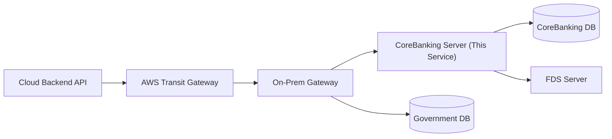

# CoreBanking: NOVA

계정계 전용 서버(Spring Boot).  
클라우드 서비스(`backend`) 요청을 받아 코어뱅킹 기능을 Open API 형태로 제공하는 BaaS(Banking as a Service) 역할을 담당한다.

## Service Scope

- 계좌 개설/조회/비밀번호 검증/이체/거래내역/메모/해외송금 처리
- 계정계 원장(잔액, 거래내역, 거래상태)의 최종 정합성 보장
- 온프레미스 코어뱅킹 DB/FDS/대외 연동(필요 시) 처리

## Architecture Context

- CoreBanking 서버는 클라우드 앱의 하위 컴포넌트가 아니라, 별도 경계의 계정계 서비스다.
- 요청 진입은 Transit Gateway/On-Prem Gateway 경유를 기본으로 한다.
- 사용자 직접 호출을 가정하지 않고, 서버 간 호출(B2B/API) 시나리오를 기본으로 한다.

## Immutable Rules

- 금융 원장 상태(잔액/거래내역/거래상태)는 CoreBanking에서만 최종 확정한다.
- 원장 변경 API는 반드시 멱등 키(요청 식별자) 또는 중복 방지 전략을 사용한다.
- 이체/출금 계열은 비밀번호 검증 및 계좌 상태 검증 없이 성공 처리하지 않는다.
- 실패 시 부분 성공 상태를 남기지 않고 보상 또는 실패 확정으로 정리한다.
- 비밀정보(API 키/인증서/계좌 비밀번호 원문)는 코드/로그/예외 메시지에 노출하지 않는다.

## Do

- 계약 우선: `backend <-> coreBanking` API 스펙을 먼저 고정하고 구현한다.
- 상태 전이 명시: `REQUESTED -> REVIEWING -> APPROVED/REJECTED -> COMPLETED/FAILED` 같은 거래 상태 흐름을 명확히 둔다.
- 감사 추적: 계좌개설/비밀번호검증/이체/해외송금은 요청-검증-처리-결과 이벤트 로그를 남긴다.
- 장애 격리: FDS/대외 연동/DB 장애를 구분해 재시도 정책과 타임아웃을 분리한다.
- 정합성 우선: 응답 속도보다 이중차감/중복이체 방지를 우선한다.

## Don't

- 클라우드 서비스 편의 로직을 계정계 내부 규칙보다 우선하지 않는다.
- 계정계에서 임의 비즈니스 규칙(비금융 도메인 규칙)을 추가하지 않는다.
- 거래 성공 전에 성공 응답을 먼저 반환하지 않는다.
- 운영 경로에서 검증 우회 플래그를 두지 않는다.

## Package Structure

Base package: `woorifisa.project.coreBanking`

- `domain/account`: 계좌 엔티티/규칙
- `domain/accountTransaction`: 계좌 거래내역
- `domain/globalTransaction`: 해외송금 거래내역
- `domain/customer`: 고객 정보/자금출처/거래목적
- `global/entity`: `BaseEntity`(감사 필드)
- `global/exception`: 공통 예외/핸들러
- `global/response`: 공통 응답 래퍼

## API Design Rules

- 경로 prefix는 `core-banking` 계열을 기본으로 유지한다.
- 삭제는 물리 삭제보다 상태 기반 soft-delete 또는 비활성화를 우선한다.
- 컨트롤러는 DTO만 입출력하고 엔티티 직접 반환을 금지한다.
- 컨트롤러 엔드포인트에는 SpringDoc 어노테이션을 작성한다.

## Logging Rules

- 로깅은 SLF4J 사용 (`@Slf4j`)
- `System.out/err`, `printStackTrace` 금지
- 로그백 롤링 파일 정책(일자/용량 기준) 적용
- 민감정보(비밀번호 원문/계좌번호 전체/식별정보 원문) 마스킹

## Validation & Idempotency

- 비밀번호 검증 API: 실패 횟수/잠금 정책을 고려한다.
- 이체 API: `transfer_request_id` 기반 중복 방지 조회를 선행한다.
- 해외송금 API: 금액/환율/수수료 부담자/국가 코드 유효성 검증을 선행한다.

## Operational Commands

- Build: `bash ./gradlew clean build`
- Run: `bash ./gradlew bootRun`
- Test: `bash ./gradlew test`
- Compile check: `bash ./gradlew compileJava`

## Document Priority

충돌 시 아래 우선순위를 따른다.

1. 가장 가까운 경로의 `AGENTS.md`
2. 루트 `AGENTS.md`
3. `coreBanking` 하위 상세 문서(ERD/API 문서)
4. 실제 코드

문서와 코드가 충돌하면 문서 기준으로 정렬하고, 결과를 작업 보고에 명시한다.
