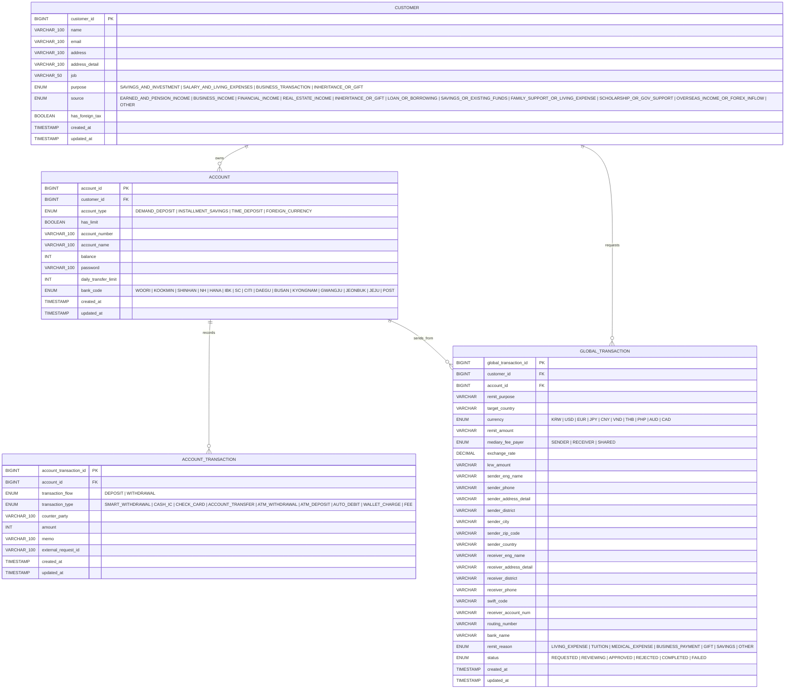

# ERD

coreBanking 서버 JPA 엔티티 기준 ERD 문서.

## Diagram

## Notes

- `global_transaction`은 해외송금 트랜잭션 전용 원장성 보조 테이블이며 이상 거래 탐지를 위한 데이터를 FDS Server에 보내기위한 데이터를 저장하고 있다.
- 원장 최종 상태는 계좌 원장(`account`, `account_transaction`)과 정합성을 맞춰 확정한다.
- `account.account_number`는 숫자 13자리 raw 문자열로 저장한다.
- 계좌번호 저장 포맷은 `S(1) + YYY(3) + C(1) + NNNNNNNN(8)`이며 `S=1`, `YYY=080`를 고정한다.
- `C`는 모듈러 방식 검증숫자를 사용한다.
- 계좌번호 조회 응답은 `SYYY-CZZ-ZZZZZZ` 포맷으로 변환해 반환하며, 하이픈은 DB에 저장하지 않는다.
