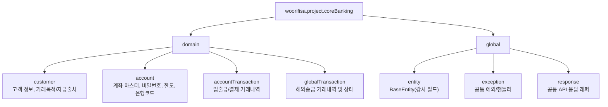

# Package Structure

Base package: `woorifisa.project.coreBanking`

## Overview

## Domain Ownership

| Domain | Responsibility |
|---|---|
| `customer` | 고객 식별/기본정보/거래목적/자금출처 |
| `account` | 계좌 개설 대상, 계좌 상태/한도/비밀번호 검증 대상 |
| `accountTransaction` | 입출금/결제 거래내역 원장 |
| `globalTransaction` | 해외송금 거래 요청/심사/처리 상태 |
| `global` | 공통 응답/예외/감사필드 |

## Placement Rules

- `customer`, `account`, `account_transaction`, `global_transaction` 엔티티는 각 도메인 `entity`에 둔다.
- enum은 각 도메인 `entity/enums` 하위에 둔다.
- 공통 코드(`BaseEntity`, 예외, 응답 래퍼)는 `global`에만 둔다.

## Dependency Direction

- `controller -> service -> repository -> entity`
- `global`은 참조만 가능하며 특정 도메인 구현에 의존하면 안 된다.
- 순환 참조를 만들지 않는다.
