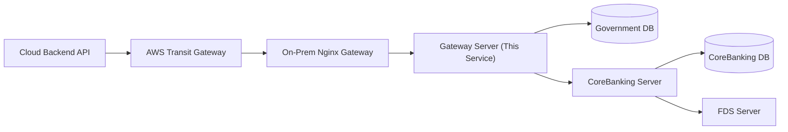

# Gateway: NOVA

온프레미스 진입점 역할을 하는 Spring Boot 서버.  
클라우드 `backend`가 AWS Transit Gateway/Private Routing을 통해 호출하는 내부 API를 제공하고, 온프레미스 내부 자원(CoreBanking Server, Government DB 등)으로 요청을 중계하거나 조회 결과를 반환한다.

## Service Scope

- 클라우드 `backend`에서 들어오는 온프레미스 내부 API 요청 수신
- Government DB 신원 정보 조회 API 제공
- 필요 시 CoreBanking/FDS 등 온프레미스 내부 서비스로 HTTP 요청 라우팅 또는 중계
- 온프레미스 DB 접속 정보와 내부 네트워크 주소를 클라우드 `backend`에 노출하지 않도록 격리
- Nginx가 앞단에 있을 경우, Nginx는 reverse proxy/TLS/라우팅을 담당하고 본 Spring Boot 서버는 실제 비즈니스 API 처리 담당

## Architecture Context



- Nginx만으로 DB 조회/JSON 응답 생성/검증 로직을 구현하지 않는다.
- Nginx는 네트워크 진입점이고, 이 서버는 온프레미스 내부 API 애플리케이션이다.
- Government DB는 별도 Spring Boot 모듈이 아니라 온프레미스 DB 인스턴스다.
- Cloud `backend`는 Government DB의 JDBC URL을 알지 않고, 이 서버의 HTTP API만 호출한다.

## Immutable Rules

- Government DB 접속 정보(URL, 계정, 비밀번호)는 `gateway` 서버 설정으로만 관리한다.
- Government DB의 주민등록번호/외국인등록번호 원문은 로그에 남기지 않는다.
- Government DB의 주민등록번호/외국인등록번호 원문은 저장하지 않는다. 정규화된 번호의 HMAC-SHA256 해시(`registration_number_hash`)만 저장/조회한다.
- 클라우드 `backend`에 Government DB의 내부 주소, 계정, 스키마 접근 권한을 노출하지 않는다.
- 금융 원장 변경은 이 서버에서 직접 확정하지 않는다. 금융 원장 상태 변경은 CoreBanking Server 책임이다.
- 인증 우회 플래그(예: `skipGovernmentCheck=true`)를 운영 경로에 추가하지 않는다.

## Do

- 계약 우선: `backend -> gateway` API 스펙을 먼저 고정하고 구현한다.
- Government DB 조회 API는 요청/응답 DTO를 명확히 두고, 엔티티를 직접 반환하지 않는다.
- 주민등록번호/외국인등록번호 비교는 `backend`가 생성한 HMAC-SHA256 해시(`registrationNumberHash`) 조회 기준으로 처리한다.
- `REGISTRATION_NUMBER_HMAC_SECRET`은 `backend`와 동일한 값을 사용해야 하며, 값 자체는 코드/로그/문서 샘플에 노출하지 않는다.
- 조회 실패, 입력 오류, DB 장애를 서로 다른 응답 코드로 구분한다.
- 내부 연동 실패는 WARN 이상으로 기록하되 민감정보는 마스킹한다.
- 헬스체크는 Actuator `health`를 우선 사용한다.

## Don't

- Nginx 설정만으로 Government DB 조회 비즈니스 로직을 구현하지 않는다.
- 클라우드 `backend`의 사용자/금융 도메인 규칙을 이 서버에 복제하지 않는다.
- Government DB 조회 API에서 필요 이상의 개인정보 필드를 반환하지 않는다.
- 운영 환경에서 `ddl-auto: update`를 사용하지 않는다. prod는 `validate`를 기본으로 한다.
- `System.out/err`, `printStackTrace`를 사용하지 않는다.

## Package Structure

Base package: `woorifisa.project.gateway`

- `domain/foreigner`: Government DB의 외국인/신분 정보 조회 도메인
- `domain/foreigner/controller`: 내부 API 엔드포인트
- `domain/foreigner/service`: 해시 기반 조회/응답 변환
- `domain/foreigner/repository`: Government DB JPA 접근
- `domain/foreigner/entity`: Government DB 테이블 매핑
- `global/exception`: 공통 예외와 예외 핸들러
- `global/response`: 공통 응답 래퍼

## API Contract

현재 `backend`가 호출하는 Government DB 조회 API:

- Method: `POST`
- Path: `/government-identities/lookup`
- Request: `registrationNumberHash`
- Response data: `name`, `issueDate`, `active`

응답은 `BaseResponse` 래퍼를 유지한다.

요청 예시:

```json
{
  "registrationNumberHash": "0123456789abcdef0123456789abcdef0123456789abcdef0123456789abcdef"
}
```

응답 예시:

```json
{
  "success": true,
  "code": "20000",
  "message": "요청에 성공했습니다.",
  "data": {
    "name": "박재하",
    "issueDate": "2024.11.13",
    "active": true
  }
}
```

## Data Rules

`foreigner` 테이블 기준 필드:

- `foreigner_id`: PK, auto increment
- `name`: 이름
- `registration_number_hash`: 주민등록번호 또는 외국인등록번호를 숫자만 남기도록 정규화한 뒤 `REGISTRATION_NUMBER_HMAC_SECRET`으로 생성한 HMAC-SHA256 hex 값
- `issue_date`: 발급일
- `active`: 유효한 신분 정보 여부

조회 키는 `registration_number_hash`이며, 원문 식별번호 컬럼은 생성하지 않는다.

## Configuration Rules

- `application-local.yaml`: 로컬 개발 DB, `ddl-auto: update` 허용
- `application-dev.yaml`: 개발 온프레미스 DB, `ddl-auto: update` 허용
- DB 설정은 환경변수 `GOVERNMENT_DB_URL`, `GOVERNMENT_DB_USERNAME`, `GOVERNMENT_DB_PASSWORD`로 처리한다.
- backend와 동일한 `REGISTRATION_NUMBER_HMAC_SECRET` 값을 설정한다.

## Logging Rules

- 로깅은 SLF4J 사용 (`@Slf4j`)
- 주민등록번호/외국인등록번호 전체값 로깅 금지
- `registrationNumberHash`도 추적 식별자로 남길 경우 일부만 마스킹한다.
- DB 장애, 외부 서비스 장애, 예외 응답은 WARN 이상으로 기록
- 정상 조회는 필요 시 식별번호를 마스킹한 형태로만 INFO 기록

## Operational Commands

- Build: `bash ./gradlew clean build`
- Run: `bash ./gradlew bootRun`
- Test: `bash ./gradlew test`
- Compile check: `bash ./gradlew compileJava`

## Document Priority

충돌 시 아래 우선순위를 따른다.

1. `gateway/AGENTS.md`
2. 루트 `AGENTS.md`
3. Gateway API/ERD 관련 문서
4. 실제 코드

문서와 코드가 충돌하면 문서 기준으로 정렬하고, 결과를 작업 보고에 명시한다.
